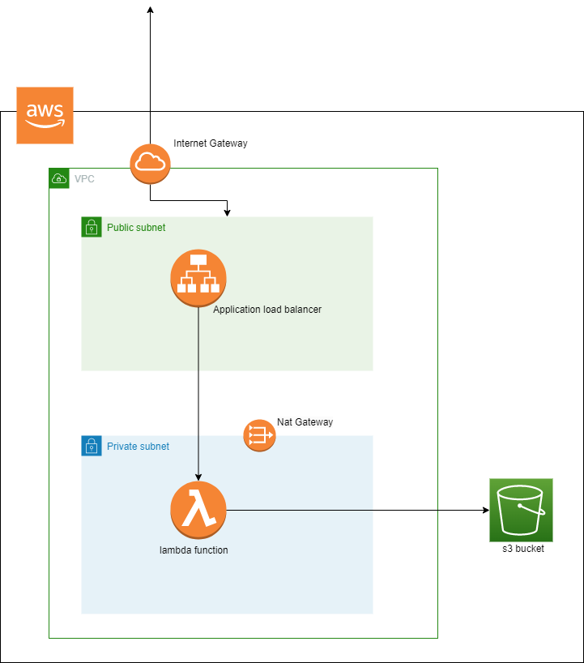

lambda invocation with alb terraform module
===========

A terraform module to provide a lambda function, vpc, s3 bucket and application load balancer in AWS,ETC.

This terraform moldule provides a lambda function in private subnet, an application load balancer in public subnet which invokes the lambda function. Also an s3 bucket which is connected to the lambda function. 

Module Input Variables
----------------------
  |Name                 | Description |                  type |
  | -------------                  | ------------- | -----------------|
| lambda_bucket                  | bucket name|string|
| lambda_file_handler        | file handler name | string|
| lambda_file_name        |  path of file or file name | string|
| lambda_function_name        | lambda function name|string|
| lambda_memory_size        | memory size| integer|
| lambda_runtime        | runtime name| string |
| prv_subnet_ids        | private subnet id |list|
| vpc_lambda        | vpc id|string
| pub_subnet_ids        | public subnet id|list|
| load_balancer_name        | load balancer name| string|
| env_vars |   environment variables |map|


Usage
-----

```hcl
module "vpc" {
  source = "terraform-aws-modules/vpc/aws"

  name = "stage_vpc"
  cidr = "10.0.0.0/16"

  azs             = ["us-east-2a", "us-east-2b"]
  private_subnets = ["10.0.1.0/24", "10.0.2.0/24"]
  public_subnets  = ["10.0.101.0/24", "10.0.102.0/24"]

  enable_nat_gateway = true
  enable_vpn_gateway = true
  enable_dns_hostnames = true
}

module "lambda_with_vpc" {
  source = "./module"
  lambda_bucket = "tes900000"
  lambda_file_handler = "hello-python.lambda_handler"
  lambda_file_name = "${path.module}/module/python/hello-python.py.zip"
  lambda_function_name = "test-lambda"
  lambda_memory_size = 512
  lambda_runtime = "python3.8"
  prv_subnet_ids = module.vpc.private_subnets
  vpc_lambda = module.vpc.vpc_id
  pub_subnet_ids = module.vpc.public_subnets
  load_balancer_name = "new-lambda"
  target_group_name = "lambda-trg"

  env_vars = {
      name = "first"
      second = "22"
    }
  }


```


Outputs
=======
|Name | Description|
|-----|------------|
|  lambda_arn| arn of the lambda function|
 |load_balancer_url| url of the load balancer |

 Architecture Diagram
 =======


<p align="center">
  
  
</p>

Authors
=======

virtuecloud.io
